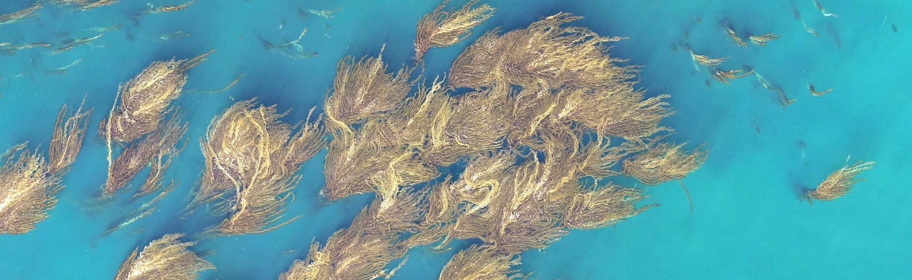

# Kelp Wanted: Segmenting Kelp Forests  



<br />  


## General
* **Competition Purpose:** Help researchers estimate the extent of Giant Kelp Forests by segmenting Landsat imagery.  
* **Type:** Semantic Segmentation
* **Host:** Mathworks
* **Platform:** Drivendata
* **Competition link:** https://www.drivendata.org/competitions/255/kelp-forest-segmentation/
* **Placement:** 3rd (3/671)  
* **User Name:** Ouranos  
* **System used:** GPU Server mainly and Google Colab Pro (for 2 models of high image size)  
* **Solution:** [write-up](./write_up_Ouranos.pdf)  
* **Train duration:** About 3 days locally and 1 day on Google Colab pro
* **Inference duration:** less than 1 hour depending on hardware

<br />  

**High Level solution description.** The solution is based on the ensemble of 9 segmentation models predictions. Each one of these predictions is a simple average of all possible flips (TTA). At post processing, a sea-land mask derived from the last image channel (altitude) was applied. Finally, probabilities turned to mask using a 0.43 threshold.

<br />  


### System    
| Characteristic   | Main Server      | Google Colab pro     | 
|------------------|------------------|----------------------|  
| Operating System | Ubuntu 18.04     | Ubuntu 22.04         |
| Cuda             | 11.2             | 12.2                 |  
| Python           | 3.8              | 3.10                 |  
| Pytorch          | 1.8              | 2.1                  |  
| GPU              | GeForce GTX 1080 | Tesla V100-SXM2-16GB | 
| RAM              | 70GB             | 50GB                 | 


#### Create virtual Environment
```shell 
virtualenv -p python3.8 kelpvenv
```

#### Activate Environment
```shell 
source kelpvenv/bin/activate
```

**Install the appropriate pytorch version for the installed cuda version**  

#### install the rest libraries with pip or pip3 
```shell
pip install -r requirement.txt
```


### Configuration  
Modify the code/config.py to specify the paths. Trained model weights should be 
placed in trained_weights directory.  
Set RETRAIN to True to retrain all models.  


### Trained models  
Extract trained models weights from zip file and set trained_weights directory 
path to config.py file.  


### Generate submission  
First run all jupyter notebooks starting with 'segm-'.  
This will generate equal number of probability prediction files in test_preds directory.  
Then run ensemble-postprocess-submission.ipynb to combine all predictions and 
make the final predictions masks and submission file.  


### Re-train models  
Set RETRAIN to True and run all notebooks. This will save new models
weights in weights directory and will overwrite existing test predictions in 
test_preds directory unless a new test_preds directory is provided in the config file.  


### Regenerate submission  
Edit the code/config.py file to change weights path (use new weights). Then rerun 
all jupyter notebooks as before.  


### Extra notebook  
There is an extra notebook provided (kelp-uppernet-512-full.ipynb). This can be 
used to replicate an alternative solution, scoring as described/proposed solution.
To generate this solution after running this notebook too, uncomment and run 
the last cell in ensemble-postprocess-submission.ipynb.  

<br /> 

## Citing This Work    
**This code has been used in the research paper "Enhancing kelp forest detection in remote sensing images using crowdsourced labels with Mixed Vision Transformers and ConvNeXt segmentation models". If you find this code useful, please consider citing it.**  
**This reasearch was published by [International Journal of Remote Sensing](https://doi.org/10.1080/01431161.2024.2448307) and It's preprint can be found on [arxiv](https://arxiv.org/abs/2501.14001).**  

If you use this repository in your research, please cite the following paper:

BibTeX:
```bibtex
@article{nasios2025enhancing,
  author = {Ioannis Nasios},
  title = {Enhancing kelp forest detection in remote sensing images using crowdsourced labels with Mixed Vision Transformers and ConvNeXt segmentation models},
  journal = {International Journal of Remote Sensing},
  year = {2025},
  publisher = {Taylor \& Francis},
  doi = {10.1080/01431161.2024.2448307},
}
```


<br />  

